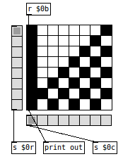

This repository is a clone of the Pd-extended SVN repository at 
https://sourceforge.net/p/pure-data/svn/HEAD/tree/trunk/externals/loaders/tclpd/, 
created via the https://git.puredata.info/cgit/ SVN-to-GIT repository 
by IOhannes m zmoelnig.

The main purpose for this fork is to add a more modern build system which 
allows creating easy distributions for multiple platforms. But some 
updating of documentation and help-files will also occur.

tclpd makes all definitions in m_pd.h and g_canvas.h available via the 
swig library (https://www.swig.org/). In addition the following procedures 
are made available (tclpd.tcl):

    proc error_msg {m} {
    proc add_inlet {self sel} {
    proc add_outlet {self {sel {}}} {
    proc outlet {self numInlet selector args} {    # used inside class for outputting some value
    proc read_class_options {classname options} {
    proc class {classname args} {                  # this handles the pd::class definition
    proc guiclass {classname args} {
    proc post {args} {                             # wrapper to post() withouth vargs
    proc args {} {
    proc arg {n {assertion any}} {
    proc default_arg {n assertion defval} {
    proc strip_selectors {pdlist} {                # converts a pd list to a Tcl list
    proc add_selector {s} {                        # a Tcl string to a pd symbol
    proc add_selectors {tcllist} {                 # converts a Tcl list to a pd list
    proc strip_empty {tcllist} {
    proc add_empty {tcllist} {
    proc guiproc {name argz body} {                # mechanism for uploading procs to gui interp, without the hassle of escaping [encoder]
    proc get_binbuf {self} {

The tclpd library as is, has no proper saveguards, crashing pd on every 
unexpected mesasage or even Tcl/Tk syntax error (without error report).

Fred Jan Kraan, 
fjkraan@electrickery.nl,
2022-12-15
